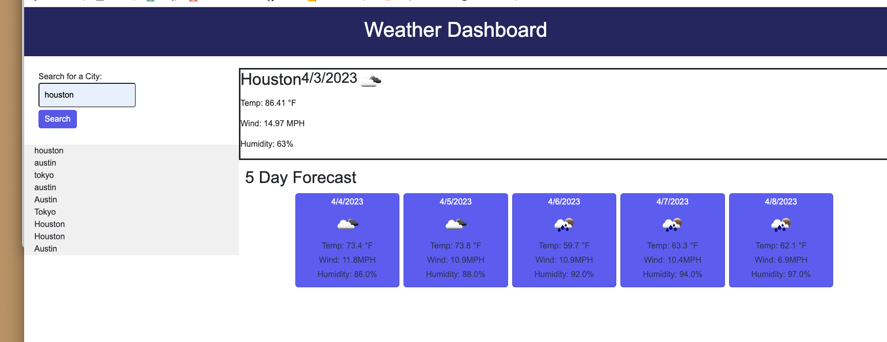

# Weather Dashboard

## Description
The purpose of this project was to build a weather dashboard that allows the user to search for a city and be presented with current conditions for the city and a five day forecast in addition. 

## Tasks Completed
* defined the API key and URL
* added an event listener to the search button on the for
* set a GET response to the API
* extracted the weather data from the API response
* stored the searched city in local storage

## Installation
N/A

## Usage
The layout of this application is optimized for different screen sizes.

Link to the deployed website - https://jomaduagwu.github.io/weather-dashboard/

## Tools
OpenWeatherMap API - https://openweathermap.org/
Bootstrap
jQuery

## License
Please refer to the LICENSE in the repo.

## Badges
N/A

## Features
N/A

